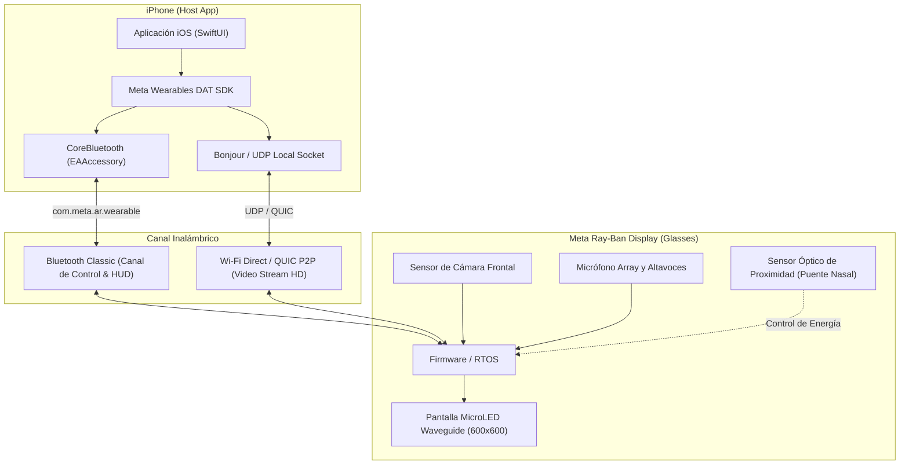
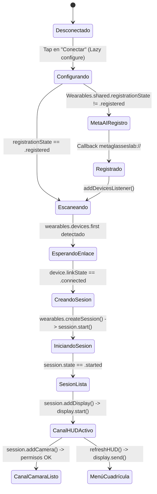

# 🧠 Meta Ray-Ban Display Smart Glasses — Central Knowledge Base

> **Última Actualización:** 2026-08-31  
> **Ámbito:** Hardware, Firmware, Bluetooth Classic, Wi-Fi UDP/QUIC, iOS MWDAT SDK, Display HUD, Camera Streaming, Audio Dictation.  
> **Propósito:** Repositorio centralizado de lecciones aprendidas, trampas de hardware, protocolos no documentados y mejores prácticas para desarrolladores humanos y agentes de Inteligencia Artificial.

---

## 📑 Índice de Navegación

1. [Arquitectura de Hardware y Comunicación](#-1-arquitectura-de-hardware-y-comunicación)
2. [Las 7 Reglas de Oro para Conexión Infalible](#-2-las-7-reglas-de-oro-para-conexión-infalible)
3. [Protocolos y Bypass de Desarrollo (App ID 0)](#-3-protocolos-y-bypass-de-desarrollo-app-id-0)
4. [Ciclo de Vida de la Sesión MWDAT](#-4-ciclo-de-vida-de-la-sesión-mwdat)
5. [Canales de Comunicación y Capacidades](#-5-canales-de-comunicación-y-capacidades)
   - [A. Display HUD (600x600 px Waveguide)](#a-display-hud-600x600-px-waveguide)
   - [B. Cámara Frontal (Video Streaming)](#b-cámara-frontal-video-streaming)
   - [C. Micrófono y Audio (Dictado en Tiempo Real)](#c-micrófono-y-audio-dictado-en-tiempo-real)
6. [Bitácora de Aprendizajes y Solución de Problemas (Knowledge Log)](#-6-bitácora-de-aprendizajes-y-solución-de-problemas-knowledge-log)
7. [Protocolo para Añadir Nuevos Aprendizajes](#-7-protocolo-para-añadir-nuevos-aprendizajes)

---

## 🏛️ 1. Arquitectura de Hardware y Comunicación

Las gafas **Meta Ray-Ban Display** utilizan una arquitectura híbrida de comunicación inalámbrica de dos capas con el iPhone:



### Características Técnicas del Hardware:
- **Pantalla HUD:** Monocular waveguide en lente derecha, resolución virtual estándar `600x600 px`, optimizada para texto e interfaces de alto contraste (fondo oscuro/transparente).
- **Cámara:** Sensor gran angular frontal, orientado a perspectiva POV (Point of View).
- **Sensores de Ahorro de Energía:** Sensor infrarrojo en el puente nasal. **Si las gafas se pliegan o se retiran de la cara, el firmware apaga el transmisor Wi-Fi y bloquea la sesión.**

---

## 🛡️ 2. Las 7 Reglas de Oro para Conexión Infalible

Cualquier aplicación o agente AI que desarrolle para estas gafas DEBE cumplir estrictamente estas 7 reglas:

| # | Regla | Motivo Técnico |
|---|---|---|
| **1** | **Inicialización Lazy (`Wearables.configure()`)** | Si se invoca en `init()` o en `.onAppear` antes de que `CBCentralManager` esté en `.poweredOn`, iOS marca la app con *API MISUSE* y mata el canal XPC de Bluetooth. |
| **2** | **Despertar Publishers Fríos (`addDevicesListener`)** | La búsqueda de dispositivos en el SDK es *reactiva*. Si no hay un listener suscrito, `wearables.devices` siempre retorna `[]`. |
| **3** | **Verificar `linkState == .connected`** | Crear una sesión cuando el dispositivo está en `.connecting` lanza `noEligibleDevice`. Se debe esperar con un bucle asíncrono. |
| **4** | **Esperar Transición a `session.state == .started`** | Invocar `.addDisplay()` o `.addCamera()` mientras la sesión está en `.starting` rompe el handshake del firmware (`sessionAlreadyStopped`). |
| **5** | **Bypass de App ID (`MetaAppID: "0"`)** | Evita la necesidad de certificados de pago de Apple (Associated Domains) y permite desarrollo local con `metaglasseslab://`. |
| **6** | **Sensor de Proximidad Activo** | Las gafas deben estar puestas en la cara o con el puente nasal cubierto con cinta/dedo durante pruebas de escritorio. |
| **7** | **Misma Red Wi-Fi sin VPN** | Para el streaming de cámara, el iPhone y las gafas deben compartir exactamente la misma subred Wi-Fi. VPNs, proxies o bloqueadores DNS locales interceptan los paquetes UDP/QUIC. |

---

---

## 🔑 3. Protocolos, Portal de Meta y Bypass de Desarrollo

Para conectar con las gafas existen dos vías: **Modo Desarrollo Rápido (Bypass Local)** y **Modo Oficial de Meta Developers**.

### 🅰️ Opción 1: Developer Mode (la vía rápida real)

> **⚠️ CORRECCIÓN (verificado contra MWDAT 0.9.0 + docs oficiales).** El "bypass con App ID 0" y la opción
> *Allow Local Developer Bypass (ID 0)* **no existen**. Lo que sí existe es **Developer Mode**, y la receta
> que tenía este documento estaba mal en los tres detalles (app, menú y número de toques).

**Cómo se activa de verdad** — en la app **Meta AI**, no en Meta View:

1. Abre la app **Meta AI**.
2. **Settings > App Info**.
3. Toca el número de **App version** **5 veces** (no 7).
4. Aparece un toggle de developer mode: actívalo y pulsa **Confirm**.
5. Tu app aparecerá en *Meta AI settings > App connections > Developer mode apps*.

Con Developer Mode: *"App attestation is **not** used in Developer Mode"*, así que valen credenciales dummy
y no necesitas publicar la app. **Limitación:** sólo **una** app de terceros puede estar registrada a la vez;
registrar otra desregistra la anterior.

**Las 4 claves de `MWDAT` son obligatorias igualmente** (`MetaAppID`, `ClientToken`, `TeamID`,
`AppLinkURLScheme`). Si faltan `ClientToken` o `TeamID`, MWDATCore aborta con
`"Partial attestation configuration detected. ClientToken and/or teamID are missing."`

**Síntoma observado con la config incompleta:** `startRegistration()` abre Meta AI, `RegistrationState`
pasa a `.registering` (2) y luego **revierte a `.available`** (1) sin pasar por `.registered` (3).

```xml
<!-- Info.plist / project.yml -->
<key>MWDAT</key>
<dict>
    <key>MetaAppID</key>
    <string>0</string>
    <key>AppLinkURLScheme</key>
    <string>metaglasseslab://</string>
</dict>

<key>UISupportedExternalAccessoryProtocols</key>
<array>
    <string>com.meta.wearables.dat</string>
    <string>com.meta.ar.wearable</string> <!-- CRÍTICO: Canal Bluetooth Classic -->
</array>

<key>CFBundleURLTypes</key>
<array>
    <dict>
        <key>CFBundleURLName</key>
        <string>com.meta.wearables.dat</string>
        <key>CFBundleURLSchemes</key>
        <array>
            <string>metaglasseslab</string>
        </array>
    </dict>
</array>
```

---

### 🅱️ Opción 2: Modo Oficial en Meta Developers Portal (Producción / TestFlight)
Requerido para publicar en App Store, distribuir builds mediante TestFlight o registrar permisos empresariales:

#### 1. Crear la App en Meta for Developers:
1. Iniciar sesión en [developers.facebook.com](https://developers.facebook.com).
2. Ir a **Mis Apps (My Apps)** > **Crear App (Create App)**.
3. Seleccionar **Otro (Other)** como tipo de caso de uso > Siguiente.
4. Tipo de aplicación: Seleccionar **Wearables / Meta Wearables Device Access Toolkit (MWDAT)** o **Negocio/Consumidor**.
5. Asignar un **Nombre para mostrar (App Display Name)** y correo de contacto.
6. En el Dashboard de la App, añadir el producto **Meta Wearables DAT**.

#### 2. Configurar la Plataforma iOS:
1. En **Ajustes de la App (Settings) > Básico (Basic)**, hacer clic en **+ Añadir Plataforma (+ Add Platform)** > Seleccionar **iOS**.
2. **Bundle ID:** Ingresar exactamente el identificador de tu app (ej. `com.instructor.GlassesInstructor`).
3. **Apple Developer Team ID:** Ingresar tu Team ID de 10 caracteres (disponible en `developer.apple.com/account`).
4. **App Links / Universal Links:** Configurar tu dominio HTTPS con el archivo `apple-app-site-association` (`applinks:tudominio.com`).

#### 3. Configurar Capacidades del SDK (Wearables Capabilities):
En la sección de Wearables DAT del portal de Meta, activar:
- `Display Waveguide Access` (Renderizado HUD).
- `Camera Live Stream (POV)` (Transmisión de video frontal).
- `Audio & Microphone Input` (Captura de voz).

#### 4. Obtener el Meta App ID Real:
Copiar el número de **App ID** (ej. `1234567890123456`) y actualizar `Info.plist`:
```xml
<key>MWDAT</key>
<dict>
    <key>MetaAppID</key>
    <string>1234567890123456</string>
    <key>AppLinkURLScheme</key>
    <string>https://tudominio.com/wearables</string>
</dict>
```

---

### 📱 5. Activación del Modo Desarrollador en la App Móvil (Meta View / Meta AI)
Para que el iPhone y las gafas autoricen la conexión desde aplicaciones de desarrollo:

1. Abrir la app **Meta View** (o **Meta AI**) en el iPhone donde están enlazadas las gafas.
2. Ir a la pestaña **Ajustes (Settings / Configuración)**.
3. Bajar hasta **Sistema / Acerca de (System / About)**.
4. **Tocar 7 veces seguidas el número de versión de la app** hasta que aparezca el mensaje emergente *"¡Ahora eres un desarrollador!"*.
5. Entrar en el nuevo menú que aparece: **Opciones de Desarrollador (Developer Options)**.
6. Activar el interruptor **Habilitar modo desarrollador para Wearables DAT (Enable Wearables DAT Developer Mode)**.
7. Si se usa el App ID `"0"`, asegurarse de que la opción **Allow Local Developer Bypass (ID 0)** esté activada.

---

## 🔄 4. Ciclo de Vida de la Sesión MWDAT



---

## 📡 5. Canales de Comunicación y Capacidades

### A. Display HUD (600x600 px Waveguide)
- **Framework:** `MWDATDisplay`
- **Componentes Declarativos Nativos:**
  - `FlexBox(direction: .column/.row, spacing: Int, alignment: .center/.start)`
  - `Text(content, style: .heading/.body, color: .primary/.secondary)`
  - `MWDATDisplay.Button(label: String, style: .primary/.secondary, onClick: { ... })`
  - `Image(image: UIImage, sizePreset: .fill)`
- **Renderizado Dinámico:**
  - Se pueden generar gráficos vectoriales y Canvas con `UIGraphicsImageRenderer` a `600x600` para transmitir HUDs complejos con fondo transparente (`cgContext.clear`).

### B. Cámara Frontal (Video Streaming)
- **Framework:** `MWDATCamera`
- **Flujo de Permisos:**
  1. `AVCaptureDevice.authorizationStatus(for: .video)` (Permiso de iOS).
  2. `try await Wearables.shared.checkPermissionStatus(.camera)` (Permiso en las gafas).
  3. `try await Wearables.shared.requestPermission(.camera)` si no está autorizado.
- **Captura de Frames:**
  - Suscripción reactiva a `camera.stream.videoFramePublisher`.
  - Conversión de frame a imagen con `frame.makeUIImage()`.

### C. Micrófono y Audio (Dictado en Tiempo Real)
- **Framework:** `AVFoundation` + `Speech` (`SFSpeechRecognizer`).
- **Flujo de Operación:**
  1. `AVAudioSession.sharedInstance().setCategory(.record, mode: .measurement, options: .duckOthers)`.
  2. Inicializar `SFSpeechAudioBufferRecognitionRequest` conectado al bus 0 de `AVAudioEngine`.
  3. Emitir el texto reconocido en tiempo real y enviarlo al HUD con `display.send()`.

---

## 📝 6. Bitácora de Aprendizajes y Solución de Problemas (Knowledge Log)

### [2026-08-31] — Fix de Bloqueo de Red Local en iOS 16+
- **Síntoma:** Al iniciar el stream de cámara, el socket UDP fallaba silenciosamente sin emitir frames.
- **Causa Raíz:** iOS 16+ requiere que la app solicite explícitamente permisos de Red Local antes de vincular sockets UDP multicast.
- **Solución:** Enviar un paquete UDP broadcast dummy al inicio de la app a `224.0.0.251:5353` y levantar un `NetServiceBrowser` dummy para activar el prompt del sistema.

### [2026-08-31] — Race Condition en `deviceSession.start()`
- **Síntoma:** Error `sessionAlreadyStopped` inmediato al añadir la capacidad de pantalla.
- **Causa Raíz:** El SDK necesita entre 300ms y 1.2s para negociar las claves criptográficas con el firmware de las gafas.
- **Solución:** Implementar un bucle de polling con `Task.sleep` esperando que `session.state == .started` antes de invocar `session.addDisplay()`.

### [2026-08-31] — Desconexión al Retirar las Gafas
- **Síntoma:** El HUD se congela y la sesión cae con `unexpectedError("Device unavailable")`.
- **Causa Raíz:** El sensor de proximidad en el puente nasal suspende el coprocesador de video para ahorrar batería.
- **Solución:** Durante pruebas en banco de trabajo, tapar el sensor nasal con cinta adhesiva opaca.

### [2026-08-31] — Conflicto de URL Scheme y Error "Proyecto ya no disponible" en Meta AI
- **Síntoma:** Al pulsar "Conectar", la app abre Meta AI y muestra *"El proyecto solicitado ya no está disponible"*.
- **Causa Raíz:** La aplicación estaba reutilizando el esquema genérico `metaglasseslab://` (de `GlassesHUD`), el cual Meta AI tenía registrado y asociado a una versión previa desinstalada o a otro bundle ID.
- **Solución:** Cada nueva app debe tener un esquema URL completamente único tanto en `CFBundleURLSchemes` como en `MWDAT.AppLinkURLScheme` (ejemplo: `metaglassesinstructor://` para `GlassesInstructor` o `metaglassesagent://` para `GlassesAgentApp`), y usar `bundleIdPrefix: com.aaron`.

---

## 🚀 7. Protocolo para Añadir Nuevos Aprendizajes

Cada vez que se descubra un nuevo comportamiento, error o técnica:
1. Abrir este archivo [`KNOWLEDGE_BASE.md`](file:///Users/aaron/dev/others/personal/glasses_display/KNOWLEDGE_BASE.md).
2. Añadir una nueva entrada en la sección **6. Bitácora de Aprendizajes** siguiendo la estructura:
   ```markdown
   ### [AAAA-MM-DD] — Título del Aprendizaje
   - **Síntoma:** Descripción del error o comportamiento observado.
   - **Causa Raíz:** Explicación técnica detallada.
   - **Solución:** Código, configuración o procedimiento aplicado para resolverlo.
   ```
3. Si el aprendizaje involucra reglas arquitectónicas, actualizar la tabla de las **7 Reglas de Oro**.
4. Realizar un commit/push al repositorio remoto (`origin`).
