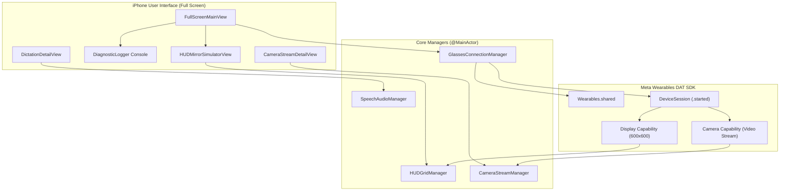

# 👓 GlassesInstructor — Manual Interactivo y App Demostrativa para Meta Ray-Ban Display


**GlassesInstructor** es una aplicación demostrativa y manual instructivo interactivo diseñado para simplificar el proceso de conexión, diagnóstico y explotación de las capacidades de pantalla (**HUD Waveguide**), **cámara frontal (streaming de video)** y **micrófono (dictado en tiempo real)** de las gafas inteligentes **Meta Ray-Ban Display**.

---

## 🌟 Características Principales

```
+-----------------------------------------------------------------------+
|                         GLASSES INSTRUCTOR                            |
+-----------------------------------------------------------------------+
|  📱 Teléfono (Full Screen)             |  👓 HUD de las Gafas (600x600)|
|  -------------------------             |  ----------------------------|
|  • HUD Live Mirror (Simulador en vivo) |  • Matriz Cuadrícula 2x2:    |
|  • Consola de Eventos y Diagnóstico   |    - [ 📷 Cámara Frontal ]    |
|  • Panel de Control Táctil 2x2        |    - [ 🎙️ Dictado Subtítulos ] |
|  • Checklist interactivo de hardware   |    - [ ⚡ Diagnóstico Link ]   |
|  • Visor de cámara y osciloscopio     |    - [ 📖 Guía Rápida ]       |
+-----------------------------------------------------------------------+
```

### 1. 📱 UI de Pantalla Completa en el iPhone (Full-Screen Edge-to-Edge)
- **HUD Live Mirror:** Reproduce en tiempo real y con precisión óptica en la pantalla del iPhone lo que el usuario está viendo a través de la lente derecha de las gafas.
- **Consola de Telemetría:** Registra cada transición de estado del SDK (`CBCentralManager` -> `Bonjour/UDP` -> `Registration` -> `DeviceSession` -> `Display/Camera`).
- **Checklist Interactivo:** Valida permisos de Bluetooth Classic, Red Local, Wi-Fi subnet y sensor de proximidad en tiempo real.

### 2. 👓 Menú en Cuadrícula 2x2 en el HUD (Waveguide 600x600 px)
Diseñado con elementos de alto contraste para máxima legibilidad óptica:
- **[ 📷 Cámara de las Gafas ]**: Inicia el stream de video frontal en tiempo real, midiendo FPS y frames transmitidos.
- **[ 🎙️ Micrófono & Dictado ]**: Captura voz y proyecta subtítulos en vivo directamente en el campo de visión del usuario.
- **[ ⚡ Estado & Diagnóstico ]**: Despliega telemetría de hardware, estado del canal Bluetooth Classic y protocolo de enlace.
- **[ 📖 Guía Rápida ]**: Presenta instrucciones concisas de hardware y comandos de interacción de la patilla.

---

## 🛠️ Requisitos Previos y Configuración

### 1. Requisitos de Hardware
- iPhone con iOS 16.0 o superior.
- Gafas Meta Ray-Ban Display (con estuche cargado).
- Red Wi-Fi compartida de 2.4 GHz o 5 GHz (sin VPNs ni proxies activos).

### 2. Generación del Proyecto Xcode con XcodeGen
El proyecto utiliza [XcodeGen](https://github.com/yonaskolb/XcodeGen) para generar de forma determinista el archivo `.xcodeproj`:

```bash
cd GlassesInstructor
xcodegen generate
open GlassesInstructor.xcodeproj
```

---

## ⚙️ Guía Exhaustiva de Configuración de `Info.plist`

El archivo `Info.plist` es el componente más crítico para que iOS y el SDK de Meta reconozcan el hardware. A continuación se desglosa cada clave obligatoria:

```xml
<?xml version="1.0" encoding="UTF-8"?>
<!DOCTYPE plist PUBLIC "-//Apple//DTD PLIST 1.0//EN" "http://www.apple.com/DTDs/PropertyList-1.0.dtd">
<plist version="1.0">
<dict>
    <!-- 1. CONFIGURACIÓN DEL SDK MWDAT (Bypass de Desarrollo sin cuenta de pago) -->
    <key>MWDAT</key>
    <dict>
        <!-- AppID "0" indica al SDK de Meta que opere en modo Sandbox local -->
        <key>MetaAppID</key>
        <string>0</string>
        <!-- Esquema para recibir el callback criptográfico de enlace -->
        <key>AppLinkURLScheme</key>
        <string>metaglassesinstructor://</string>
    </dict>

    <!-- 2. REGISTRO DE ESQUEMA URL (Para redirección desde Meta AI / Meta View) -->
    <key>CFBundleURLTypes</key>
    <array>
        <dict>
            <key>CFBundleTypeRole</key>
            <string>Editor</string>
            <key>CFBundleURLName</key>
            <string>com.meta.wearables.dat</string>
            <key>CFBundleURLSchemes</key>
            <array>
                <string>metaglassesinstructor</string>
            </array>
        </dict>
    </array>

    <!-- 3. PROTOCOLOS DE HARDWARE BLUETOOTH CLASSIC (CRÍTICO) -->
    <!-- Sin estos dos protocolos, iOS bloqueará la comunicación por Bluetooth con las gafas -->
    <key>UISupportedExternalAccessoryProtocols</key>
    <array>
        <string>com.meta.wearables.dat</string>
        <string>com.meta.ar.wearable</string>
    </array>

    <!-- 4. CONSULTA DE APLICACIONES INSTALADAS (Meta View / Meta AI) -->
    <key>LSApplicationQueriesSchemes</key>
    <array>
        <string>fb-viewapp</string>
        <string>metaai</string>
    </array>

    <!-- 5. MODOS EN SEGUNDO PLANO (Para mantener la conexión con el HUD activa) -->
    <key>UIBackgroundModes</key>
    <array>
        <string>audio</string>
        <string>bluetooth-peripheral</string>
        <string>external-accessory</string>
    </array>

    <!-- 6. PERMISOS Y DESCRIPCIONES DE PRIVACIDAD DEL SISTEMA -->
    <key>NSBluetoothAlwaysUsageDescription</key>
    <string>Se requiere Bluetooth para descubrir y conectar las gafas inteligentes Meta Ray-Ban.</string>
    <key>NSBluetoothPeripheralUsageDescription</key>
    <string>Se requiere Bluetooth para comunicarse con las gafas inteligentes.</string>
    <key>NSCameraUsageDescription</key>
    <string>Se requiere acceso a la cámara de las gafas para transmitir video y guiar al usuario.</string>
    <key>NSLocalNetworkUsageDescription</key>
    <string>Se requiere acceso a la red local para el canal de streaming de video de alta velocidad.</string>
    <key>NSMicrophoneUsageDescription</key>
    <string>Se requiere acceso al micrófono para capturar voz y transcribir subtítulos en el HUD.</string>
    <key>NSSpeechRecognitionUsageDescription</key>
    <string>Se requiere reconocimiento de voz para convertir dictado en subtítulos en tiempo real.</string>
</dict>
</plist>
```

---

## 🌐 Configuración del Proyecto en Meta Developers Portal (`developers.facebook.com`)

Existen dos maneras de ejecutar y autorizar la aplicación:

### 1. ✅ Vía Rápida: **Developer Mode** (no "App ID 0")
El bypass por `MetaAppID: "0"` **no existe**. La vía rápida real es Developer Mode, que se activa en la app
**Meta AI** (no Meta View): *Settings > App Info > toca **App version** 5 veces > activa el toggle > Confirm*.

En Developer Mode *"App attestation is not used"*, así que sirven credenciales dummy sin publicar la app.
Sólo puede haber **una** app de terceros registrada a la vez.

Aun así, el dict `MWDAT` debe traer sus **4 claves**: `MetaAppID`, `ClientToken`, `TeamID` y
`AppLinkURLScheme` (este último **sí lleva** el sufijo `://`). Si faltan `ClientToken` o `TeamID`, el SDK
aborta con *"Partial attestation configuration detected"*.

### 2. Vía Oficial: Wearables Developer Center — *Para builds publicables*
Regístrate en **[wearables.developer.meta.com](https://wearables.developer.meta.com)**, crea tu organización,
un proyecto y un *release channel*, y añade tu cuenta como test user. Después:
1. **Crear App en Meta:**
   - Accede a [developers.facebook.com](https://developers.facebook.com) con tu cuenta de Meta.
   - Ve a **My Apps > Create App** > Selecciona **Other** > Caso de uso: **Wearables / Meta Wearables DAT**.
   - Ingresa el nombre de la app y correo de contacto.
2. **Vincular Plataforma iOS:**
   - En el Dashboard de la App, ve a **Settings > Basic > + Add Platform > iOS**.
   - Configura el **Bundle Identifier** (ej. `com.instructor.GlassesInstructor`).
   - Configura tu **Apple Team ID** (disponible en tu cuenta de Apple Developer).
   - Configura tus **Universal Links / App Links** (archivo `apple-app-site-association`).
3. **Solicitar Capacidades de Wearables DAT:**
   - Activa los permisos de `Display Waveguide`, `Camera Video Stream` y `Microphone`.
4. **Actualizar el Meta App ID:**
   - Copia tu **App ID numérico real** desde la barra superior del portal de Meta y reemplaza el `"0"` en tu `Info.plist` o `project.yml`.

---

## 🏗️ Arquitectura de la Solución



---

## 🚦 Flujo de Conexión de 8 Pasos

1. **Prompt de Red Local:** Envío de paquete UDP broadcast dummy para activar el permiso en iOS 16+.
2. **Inicialización Lazy:** Invocación de `try Wearables.configure()` únicamente al pulsar *"Conectar"*.
3. **Bypass de Registro (`MetaAppID: "0"`):** Redirección mediante `metaglasseslab://` hacia Meta AI / Meta View.
4. **Despertar Bluetooth Scanner:** Suscripción activa a `wearables.addDevicesListener`.
5. **Espera de `linkState == .connected`:** Sondeo hasta confirmar que el hardware físico está enlazado.
6. **Handshake de Sesión Criptográfica:** Creación de `DeviceSession` y espera de transición a estado `.started`.
7. **Montaje de Capacidades:**
   - `.addDisplay()` -> Canal HUD (600x600).
   - `.addCamera()` -> Canal de Video.
8. **Renderizado Inicial:** Emisión de la cuadrícula 2x2 en el HUD mediante `display.send()`.

---

## ⚠️ Guía Rápida de Solución de Problemas (Troubleshooting)

| Error Observado | Causa Frecuente | Solución Inmediata |
|---|---|---|
| `API MISUSE: CBCentralManager` | SDK inicializado en `init()` o Bluetooth apagado en iPhone | Encender Bluetooth en Ajustes y conectar desde la app |
| `sessionAlreadyStopped` | Se intentó llamar a `.addDisplay()` o `.addCamera()` antes de que la sesión estuviera en `.started` | Dejar que el gestor complete el polling de handshake |
| `Device unavailable` | Gafas plegadas, guardadas en estuche o no colocadas en la cara | Colocarse las gafas o cubrir el sensor óptico nasal con cinta |
| `Empty devices list []` | Scanner de Bluetooth dormido (cold publisher) | `GlassesConnectionManager` suscribe un token para forzar el escaneo activo |
| `Video Stream sin frames` | VPN activa o iPhone y gafas en diferentes subredes Wi-Fi | Desactivar VPNs/AdGuard y conectar ambos al mismo SSID |

---

## 📚 Base de Conocimiento Central
Para consultar el registro histórico de lecciones aprendidas de hardware y firmware o documentar nuevos hallazgos, visita la [KNOWLEDGE_BASE.md](../KNOWLEDGE_BASE.md) ubicada en la raíz del repositorio.
